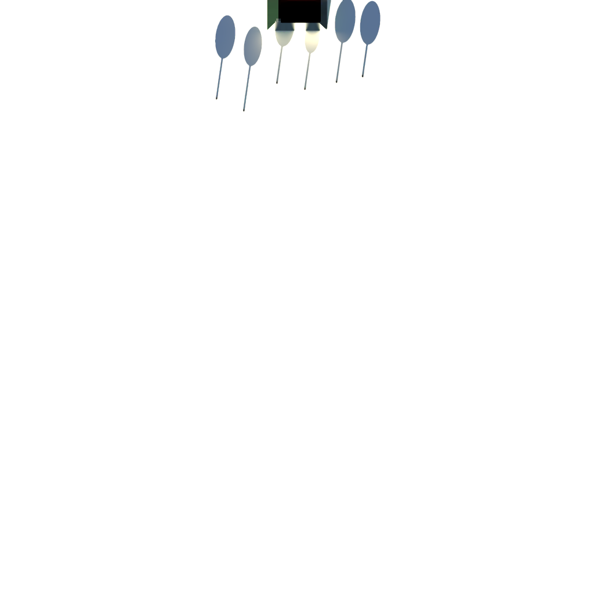
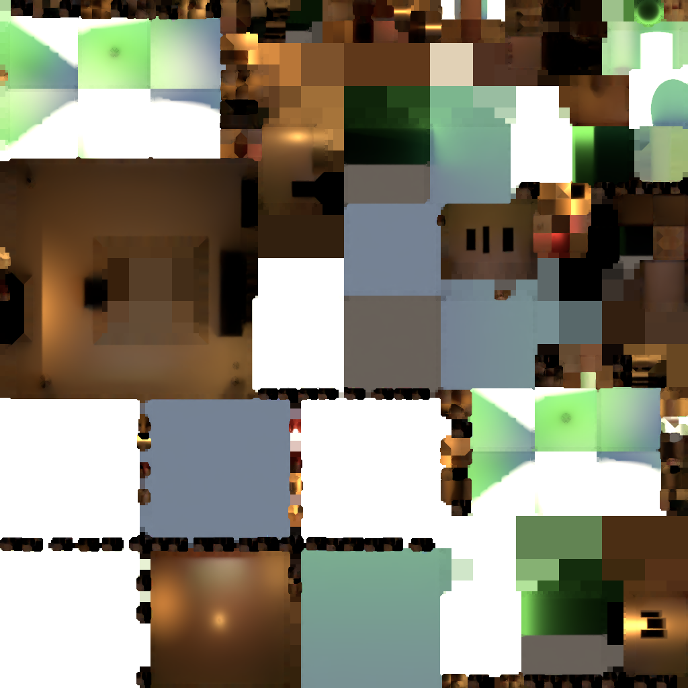
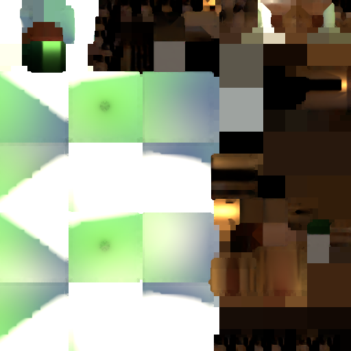
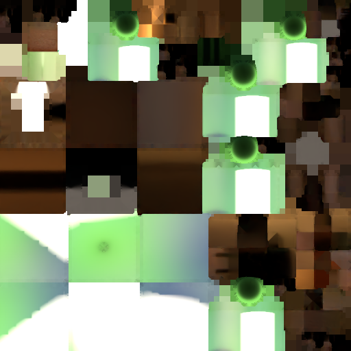
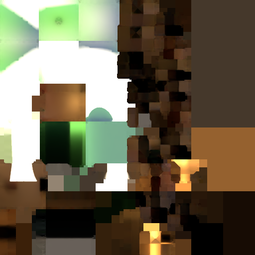

# Práctica N.° 5: Unity 6 + XR

Escena inmersiva con **iluminación pre-calculada (lightmaps)** y **audio espacial 3D**, para el Laboratorio XR de la Universidad Autónoma del Perú. Se prueba en PC con el **XR Device Simulator**; no requiere visor.

## Resumen

| Dato | Valor |
|---|---|
| Proyecto | `Practica05_XR_Inmersion` |
| Editor | Unity 6.4 (6000.4.2f1), Universal Render Pipeline |
| XR | XR Interaction Toolkit 3.2.1 + XR Device Simulator |
| Escena | `Assets/Scenes/Practica05.unity` |
| Luces | Baked: 1 Directional (sol) + 3 Point Lights |
| Lightmapper | Progressive GPU (NVIDIA GeForce RTX 4050 Laptop GPU) |
| Parámetros del bake | 40 texels/unidad, tamaño máx. 1024, muestras directas 64 / indirectas 256 / entorno 128, 3 rebotes |
| Lightmaps generados | 5 (2 de 1024×1024 y 3 de 512×512) |
| Tiempo de bake | 00:00:36.9 |
| FPS en Play Mode (PC) | promedio 231,1 · máx. 311,7 · mín. 0,2 |
| Audio 3D | Spatial Blend 1.0 + Logarithmic Rolloff (Min 1 m, Max 15 m) |

## La escena

Sala de estar de 10 × 8 m con una ventana en la pared norte: parquet con textura generada por código, zócalo y friso, alfombra, sofá, sillón, mesa de centro, aparador, estantería con libros, lámpara de pie, lámpara colgante, plantas, cuadros y un jardín visible desde la ventana.

- **Static:** toda la geometría arquitectónica y el mobiliario fijo, para que participen en el bake.
- **Baked:** el sol entra por la ventana y proyecta una mancha de luz sobre el piso; las lámparas aportan luz cálida y sus pantallas emiten luz horneada (Baked Emissive).
- **`Audio_Object`:** una radio sobre el aparador (pared este). **No es estática**, porque es la fuente de sonido; recibe la luz horneada mediante Light Probes.
- **XR:** `XR Origin (XR Rig)` con el único Audio Listener, más el `XR Device Simulator` para moverse con teclado y mouse.
- **`FPS_Counter`:** muestra los FPS actuales y el promedio en pantalla.

## Lightmaps generados

Exportados desde el Editor después del bake (carpeta [`Evidencias`](Evidencias)).

| | | |
|---|---|---|
|  |  |  |
| Lightmap-0 | Lightmap-1 | Lightmap-2 |
|  |  | |
| Lightmap-3 | Lightmap-4 | |

## Audio espacial

El Audio Source de la radio usa Loop, Play On Awake, Spatial Blend 1.0 y atenuación logarítmica con Min Distance 1 y Max Distance 15, ajustados al tamaño de la sala. Se añadió una Reverb Zone con el preset Room.

> **Limitación:** el proyecto no tiene instalado ningún plugin de spatializer HRTF (por ejemplo Meta XR Audio), así que la dirección se percibe con el panning 3D estándar de Unity. El Audio Source ya tiene `Spatialize` activado para cuando se instale uno.

## Rendimiento

Se midieron 2210 cuadros durante 15 s en Play Mode (tras 3 s de calentamiento): **231,1 FPS** de promedio. El mínimo de 0,2 FPS es un único cuadro detenido, no el comportamiento sostenido.

> **Alcance:** la medición se hizo en el Editor de una PC con RTX 4050 Laptop, sin visor. No es representativa de un Meta Quest; sirve como referencia relativa.

Los datos crudos están en [`bake_report.txt`](bake_report.txt) y [`fps_report.txt`](fps_report.txt).

## Cómo probar la escena

1. Abre el proyecto con **Unity 6000.4.2f1** (Unity Hub > Add project from disk).
2. Abre `Assets/Scenes/Practica05.unity`.
3. Pulsa **Play**. Muévete con el XR Device Simulator (las teclas se muestran en un panel en la ventana Game).
4. Acércate y aléjate de la radio y gira para dejarla a izquierda, derecha y detrás: el volumen y la dirección del sonido cambian.

### Reconstruir la escena y el bake

El menú **Practica05** del Editor ejecuta los scripts de [`Assets/Editor`](Assets/Editor):

- **1. Construir escena** crea la sala, los materiales y las luces.
- **2. Hornear luz (Bake)** genera los lightmaps y guarda el tiempo en `bake_report.txt`.
- **4. Medir FPS (Play 15 s)** mide los FPS y guarda `fps_report.txt`.

## Estructura

```
Assets/
  Audio/          campana.wav (generado por código)
  Editor/         scripts que construyen la escena y hornean la luz
  Materials/      materiales URP y textura de parquet
  Samples/        Starter Assets y XR Device Simulator (XRI 3.2.1)
  Scenes/         Practica05.unity + datos de lightmaps
  Scripts/        FPSCounter.cs
Evidencias/       lightmaps exportados
tools/            make_report.py (genera el PDF)
Reporte_Practica05.pdf
```

## Entregables

- [x] Repositorio en GitHub (este).
- [x] Lightmaps generados ([`Evidencias`](Evidencias)).
- [x] Reporte PDF con tiempos de bake y FPS: [`Reporte_Practica05.pdf`](Reporte_Practica05.pdf).
- [ ] Video de navegación con el cambio de volumen y dirección del audio (se entrega por separado).
